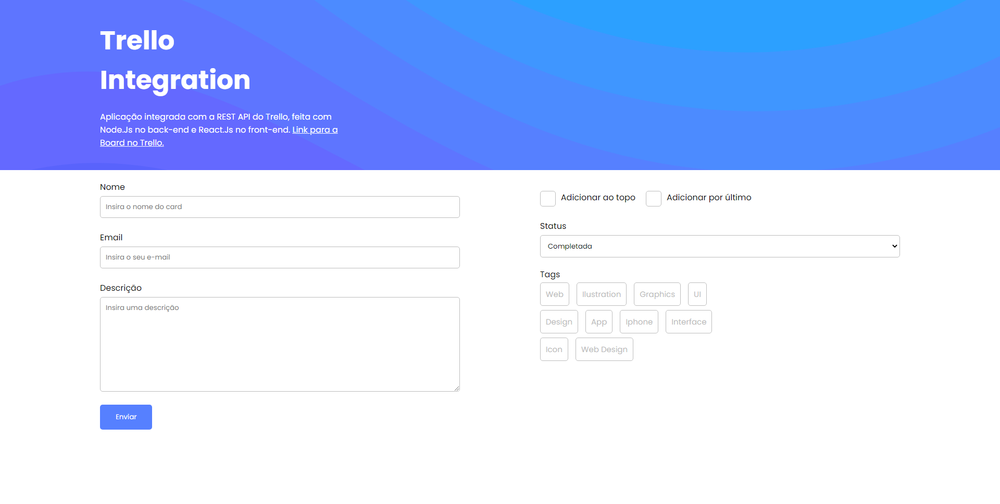

# Integração com Trello
- [Veja este projeto funcionando](https://trello-react-node.herokuapp.com/)

## Sobre o projeto
Aplicação integrada com a REST API do Trello, feita com Node.Js no back-end e React.Js no front-end.

## Links
- [App](https://trello-react-node.herokuapp.com/) - Link para o App
- [Trello](https://trello.com/b/AA4T6jQB/trello-interaction) - Link para a board no Trello

## Built With

- [Trello](https://developer.atlassian.com/cloud/trello/rest/api-group-actions/) - REST API
- [React.Js](https://pt-br.reactjs.org/) - Client Side/Validação de dados
- [Node.Js](https://nodejs.org/en/) - Server Side
- [Joi](https://www.npmjs.com/package/joi) - Validação de dados no Back-end
- [Express](https://expressjs.com/) - Servidor e rotas

